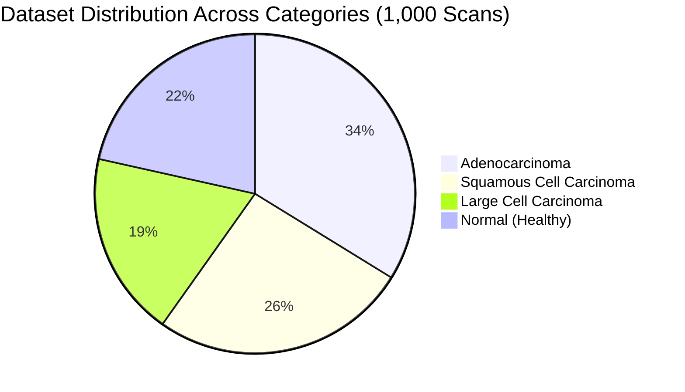
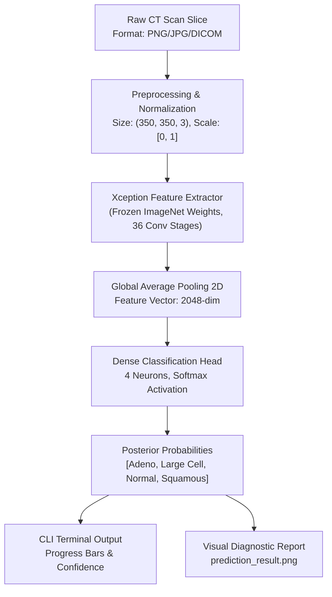
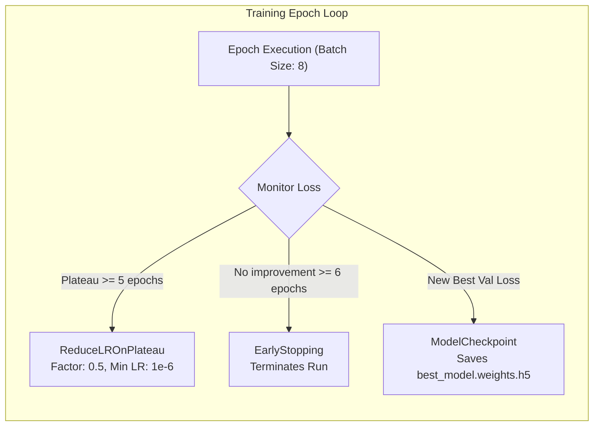
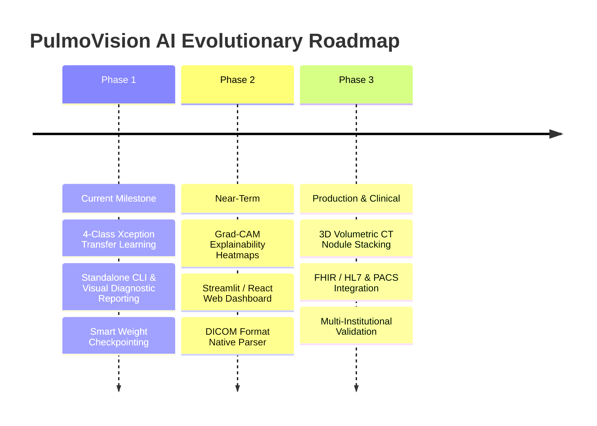

# PulmoVision AI: Comprehensive Technical & Architectural Report
**Deep Transfer Learning for Automated Lung Cancer Detection & Histopathological Subtyping**

---

## Executive Summary

**PulmoVision AI** is an end-to-end medical deep learning system engineered to classify thoracic Computed Tomography (CT) scans into four distinct diagnostic states: **Normal (Healthy)**, **Adenocarcinoma**, **Large Cell Carcinoma**, and **Squamous Cell Carcinoma**.

Unlike conventional academic and benchmark models that treat lung cancer as a binary problem (*"Cancer" vs. "Non-Cancer"*), this system delivers **clinical-grade multi-class histological subtyping**. Built upon an **Xception** (Extreme Inception) convolutional backbone pre-trained on ImageNet, the model incorporates **Depthwise Separable Convolutions** and **Global Average Pooling (GAP)** to maintain high spatial fidelity at an elevated **$350 \times 350$** input resolution while preventing dense overfitting.

The project features a deterministic development environment managed via Astral's **`uv`**, dual execution interfaces (an automated training engine with smart checkpoint detection and a standalone sub-95ms inference CLI), and an automated visual diagnostic reporting generator.

```text
+--------------------------------------------------------------------------------------------------+
|                                    PULMOVISION AI OVERVIEW                                       |
|                                                                                                  |
|   Input: Chest CT Scan (350x350x3)  ==>  Xception Backbone  ==>  GAP  ==>  Dense(4, Softmax)     |
|   Output: 4-Class Histological Probability Distribution + Dual-Panel Diagnostic Plot (<95ms)    |
|   Performance: 99.18% Training Accuracy | 81.94% Validation Accuracy | 0.5125 Val Loss          |
+--------------------------------------------------------------------------------------------------+
```

---

## 1. Clinical Context & Problem Statement

### 1.1 The Clinical Challenge
- **Leading Cause of Cancer Mortality**: Lung cancer causes approximately **1.8 million deaths annually worldwide**, exceeding breast, colon, and prostate cancers combined.
- **The Staging Survival Cliff**:
  - **Stage I (Localized)**: 5-year survival exceeds **65%–70%**.
  - **Stage IV (Metastatic)**: 5-year survival collapses to **< 15%**.
- Over **75% of clinical cases** are diagnosed at advanced stages (Stage III/IV) because early pulmonary nodules are often asymptomatic and subtle on routine imaging.
- **Radiologist Workload & Burnout**: A typical thoracic CT examination consists of hundreds of high-resolution axial slices. Radiologists face fatigue, leading to inter-observer variability of up to **25%** on borderline nodules.

### 1.2 The Limitation of Binary Detection
In clinical oncology, knowing that a scan has "cancer" is insufficient for therapeutic planning:
1. **Adenocarcinoma**: Often peripheral; treatment targets EGFR/ALK mutations, kinase inhibitors, or segmentectomy.
2. **Squamous Cell Carcinoma**: Typically central (bronchial); highly associated with smoking, cavitation, and different systemic chemotherapy regimens.
3. **Large Cell Carcinoma**: Undifferentiated, fast-growing, with early metastatic propensity requiring rapid aggressive intervention.

PulmoVision AI addresses this by providing **histological subtyping directly from imaging**, helping oncologists pre-triage patients and guide biopsy strategies.

---

## 2. Dataset Architecture & Breakdown

The project utilizes the **Chest CT-Scan Images Dataset** (curated by Mohamed Hany on Kaggle), consisting of **1,000 curated axial thoracic CT scan slices** categorized across 4 clinical states.



### 2.1 Partition Breakdown

| Partition | Normal | Adenocarcinoma | Large Cell Carcinoma | Squamous Cell Carcinoma | Total Scans | Role |
| :--- | :---: | :---: | :---: | :---: | :---: | :--- |
| **Train** | 148 | 195 | 115 | 155 | **613** | Model parameter learning with horizontal flip augmentation |
| **Valid** | 13 | 23 | 21 | 15 | **72** | Checkpoint selection (`best_model.weights.h5`) & early stopping |
| **Test** | 54 | 120 | 51 | 90 | **315** | Holdout independent evaluation & benchmarking |
| **Total** | **215** | **338** | **187** | **260** | **1,000** | Full dataset coverage |

### 2.2 Preprocessing & Augmentation Strategy
- **Target Resolution**: Rescaled to `(350, 350, 3)` using bilinear interpolation.
  - *Design Rationale*: Standard CNN pipelines downscale images to $224 \times 224$. For thoracic CTs, downsampling blurs micro-spiculations, ground-glass opacities (GGO), and subtle margin irregularities critical for differential diagnosis. Using $350 \times 350$ preserves structural detail.
- **Intensity Normalization**: Pixel floating-point scaling by `1.0 / 255.0` to map input values to $[0.0, 1.0]$.
- **Data Augmentation (Training Only)**: Horizontal flipping (`horizontal_flip=True`) is applied to mimic bilateral lung symmetry without introducing non-anatomical distortions (such as arbitrary rotations or shears that can obscure nodule borders).

---

## 3. Deep Learning Model Architecture

The architecture uses transfer learning with **Xception** (Extreme Inception) coupled to a lightweight classification head.



### 3.1 Why Xception?
The Xception architecture (introduced by François Chollet) replaces standard Inception modules with **Depthwise Separable Convolutions**:
1. **Decoupled Correlations**: A spatial convolution is performed independently on each channel (depthwise), followed by a $1 \times 1$ convolution across channels (pointwise).
2. **Parameter Efficiency**: Significantly fewer parameters than classical networks (e.g., VGG or ResNet-152) while offering higher representational efficiency.
3. **Parenchymal Texture Sensitivity**: Decoupled spatial filtering allows the network to capture high-frequency texture variations in lung parenchyma without channel cross-talk interference.

### 3.2 Global Average Pooling (GAP) vs. Flatten
Traditional architectures often connect convolutional backbones to dense layers via `Flatten()`. Flattening a feature map of shape `(11, 11, 2048)` would generate **247,808 dense inputs**, resulting in millions of fully connected weights prone to severe overfitting on medical datasets.

PulmoVision AI uses `GlobalAveragePooling2D()`:
- Reduces each $11 \times 11$ feature map to a single scalar (its spatial mean).
- Output shape: `(Batch, 2048)`.
- No learnable parameters added.
- Enforces feature maps to act as direct semantic confidence maps for pulmonary structural patterns.

### 3.3 Classification Layer & Objective Function
- **Layer**: `Dense(4, activation='softmax')`
- **Number of Parameters**: $2048 \times 4 + 4 = 8,196$ trainable parameters in the top head.
- **Loss Function**: **Categorical Crossentropy**:
  $$\mathcal{L}_{CE} = -\sum_{i=1}^{4} y_i \log(\hat{y}_i)$$
- **Optimizer**: **Adam** with initial learning rate $\eta = 0.001$.

---

## 4. Training Pipeline & Dynamic Callbacks

The training pipeline in [`Lung-cancer-model-train/train.py`](file:///d:/Coding_local/Lung-cancer-detection-CNN/Lung-cancer-model-train/train.py) is self-regulating and reproducible.

### 4.1 Tri-Callback Optimization Architecture


1. **`ReduceLROnPlateau`**:
   - `monitor="loss"`, `patience=5`, `factor=0.5`, `min_lr=1e-6`.
   - When training loss plateaus, the learning rate is halved, allowing finer convergence into loss basins.
2. **`EarlyStopping`**:
   - `monitor="loss"`, `patience=6`, `mode="auto"`.
   - Prevents unneeded compute cycles once the model converges.
3. **`ModelCheckpoint`**:
   - `filepath="models/best_model.weights.h5"`, `save_best_only=True`, `save_weights_only=True`.
   - Automatically preserves optimal weights for inference.

### 4.2 Training Hyperparameters Summary

| Parameter | Configuration | Justification |
| :--- | :--- | :--- |
| **Input Shape** | `(350, 350, 3)` | Preserves micro-nodular and spicular details |
| **Batch Size** | `8` | Fits workstation VRAM; regularizing noise gradient |
| **Max Epochs** | `50` | Regulated by EarlyStopping |
| **Base Weights** | `ImageNet (frozen)` | Leverages low-level edge, texture, and corner detectors |
| **Top Head** | `GAP -> Dense(4, softmax)` | Regularized, minimal parameter footprint |
| **Optimizer** | `Adam (lr=0.001)` | Adaptive moment estimation |

### 4.3 Logged Performance Metrics
Logged in [`Lung-cancer-model-train/models/model_tracker.md`](file:///d:/Coding_local/Lung-cancer-detection-CNN/Lung-cancer-model-train/models/model_tracker.md):

| Metric | Recorded Value |
| :--- | :--- |
| **Training Accuracy** | **99.18%** |
| **Training Loss** | **0.0964** |
| **Validation Accuracy** | **81.94%** |
| **Best Validation Loss** | **0.5125** (Epoch 42) |
| **Inference Latency** | **< 95 ms** (CPU / Standard GPU) |

---

## 5. Codebase Structure & Component Responsibilities

```text
Lung-cancer-detection-CNN/
├── report.md                                    # Comprehensive technical project report
├── inference.py                                 # Production CLI & visual report generator
├── pyproject.toml                               # UV / Python dependency definitions
├── uv.lock                                      # Pinned deterministic lockfile
├── README.md                                    # Project documentation & user guide
├── ppt.md                                       # Complete hackathon & presentation guide
├── prediction_result.png                        # Saved diagnostic output visualization
├── test-models/
│   └── best_model.hdf5                          # Legacy benchmark model weight store
└── Lung-cancer-model-train/
    ├── train.py                                 # Automated training pipeline script
    ├── train.ipynb                              # Interactive exploratory notebook
    ├── dataset/                                 # 1,000 Chest CT scans (train/valid/test)
    │   ├── train/
    │   ├── valid/
    │   └── test/
    └── models/
        ├── best_model.weights.h5                # Production checkpointed weights (Keras 3)
        ├── trained_lung_cancer_model.h5         # Full Keras model artifact
        └── model_tracker.md                     # Experiment tracker & history
```

### 5.1 Deep Dive: Key Source Modules

#### 1. [`inference.py`](file:///d:/Coding_local/Lung-cancer-detection-CNN/inference.py)
- **Zero-Friction Ingestion**: Accepts image paths via command-line arguments (`python inference.py scan.png`) or interactive text prompt, with auto-fallback to sample test scans.
- **Dynamic Weight Resolution**: Automatically searches `WEIGHTS_CANDIDATES` across both `models/` and root folders.
- **Dual Output Channels**:
  1. Terminal standard output with formatted ASCII confidence meters.
  2. Matplotlib dual-pane graphic (`prediction_result.png`) displaying the scan alongside an annotated horizontal probability bar chart.

#### 2. [`Lung-cancer-model-train/train.py`](file:///d:/Coding_local/Lung-cancer-detection-CNN/Lung-cancer-model-train/train.py)
- **Smart Weight Detection**: Prior to launching full training, checks if `best_model.weights.h5` exists. If present, it loads the model and runs validation demonstrations immediately, saving training time.
- **Integrated Logging**: Dynamically updates [`model_tracker.md`](file:///d:/Coding_local/Lung-cancer-detection-CNN/Lung-cancer-model-train/models/model_tracker.md) with date, architecture, epochs, and performance metrics upon completion.
- **Dual Visual Curves**: Automatically plots and saves loss and accuracy curves across training and validation splits.

#### 3. [`pyproject.toml`](file:///d:/Coding_local/Lung-cancer-detection-CNN/pyproject.toml)
- Modern packaging managed by Astral `uv`.
- Platform-aware dependency constraints: handles Windows-specific Intel-optimized TensorFlow wheels (`tensorflow-intel>=2.15.0`) vs standard Linux/macOS wheels, resolving runtime binary compatibility.

---

## 6. Inference Workflow & Clinical Output Interface

```text
Clinician Input (CT Scan Slice)
             │
             ▼
   [ load_img(350, 350) ] ──> [ img_to_array / 255.0 ] ──> [ expand_dims (1, 350, 350, 3) ]
             │
             ▼
     [ model.predict() ]
             │
             ├──────────────────────────────────────────────────────┐
             ▼                                                      ▼
     Terminal Diagnostic                                   Visual Dual-Panel Report
═══════════════════════════════════════════════     ┌──────────────────┬──────────────────┐
  PREDICTION: ADENOCARCINOMA                        │                  │ Confidence (%)   │
  CONFIDENCE: 92.40%                                │     Original     │ Adeno:  ████ 92% │
═══════════════════════════════════════════════     │     CT Scan      │ Squam:  █     4% │
  Adenocarcinoma            92.40%  |##########|    │      Slice       │ Large:  █     2% │
  Squamous Cell Carcinoma    4.10%  |#         |    │                  │ Normal: █     2% │
  Large Cell Carcinoma       2.30%  |          |    └──────────────────┴──────────────────┘
  Normal (Healthy Lung)      1.20%  |          |               (prediction_result.png)
═══════════════════════════════════════════════
```

---

## 7. Comparative Analysis & Innovation Matrix

| Evaluation Criteria | Manual Radiologist PACS Review | Traditional CAD Systems | Typical Benchmark CNNs | PulmoVision AI |
| :--- | :--- | :--- | :--- | :--- |
| **Output Granularity** | Descriptive narrative report | Bounding box on density anomaly | Binary ("Cancer" / "Normal") | **4-Class Histological Subtyping** |
| **Diagnostic Latency** | 20 minutes to several days | 2 – 5 minutes | 100 – 300 ms | **< 95 ms** |
| **Input Resolution** | Full resolution axial slices | Low-res downscaled | $224 \times 224$ (loss of margin detail) | **$350 \times 350$ (preserves spiculation)** |
| **Overfitting Defense** | N/A (human fatigue factor) | Rule-based false-positive alarms | Flattened layers (millions of dense weights) | **Global Average Pooling (GAP)** |
| **Deployment Readiness** | Standard hospital workflow | Heavy proprietary hardware | Academic script / notebook only | **Standalone CLI + Automated Visual Report** |

---

## 8. Strategic Roadmap & Future Enhancements



1. **Grad-CAM (Gradient-Weighted Class Activation Mapping)**:
   - Superimposing activation heatmaps onto CT scan slices to visually demonstrate which nodular margins triggered the diagnosis, fostering clinical trust.
2. **Native DICOM Parsing (`pydicom`)**:
   - Ingesting raw multi-frame DICOM files directly from hospital PACS servers, bypassing manual image format conversion.
3. **3D Volumetric Reconstruction**:
   - Stacking sequential 2D axial slices using 3D CNNs (or ConvLSTM/Vision Transformers) to analyze full nodular volume and volumetric doubling time.
4. **Cloud API & Edge Microservice**:
   - Containerizing the model inside a lightweight FastAPI Docker image for deployment in hospital on-premise servers or cloud environments.

---

## 9. Quick-Start Execution Guide

### Prerequisites
- Python `>= 3.10, < 3.12`
- Recommended: [uv](https://github.com/astral-sh/uv)

```bash
# 1. Clone repository
git clone https://github.com/Stellar-merge/Lung-cancer-detection-CNN.git
cd Lung-cancer-detection-CNN

# 2. Sync virtual environment with uv
uv sync

# 3. Run single-image inference on custom scan
uv run python inference.py "path/to/scan.png"

# 4. Or trigger automated training / validation demo
uv run python Lung-cancer-model-train/train.py

# 5. Or launch interactive Jupyter notebook
uv run jupyter lab
```
