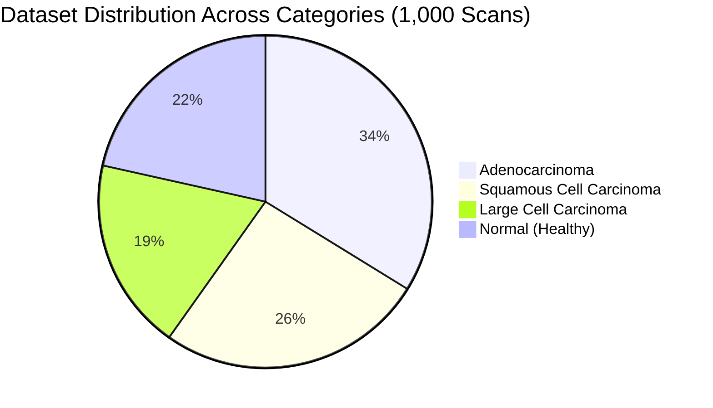
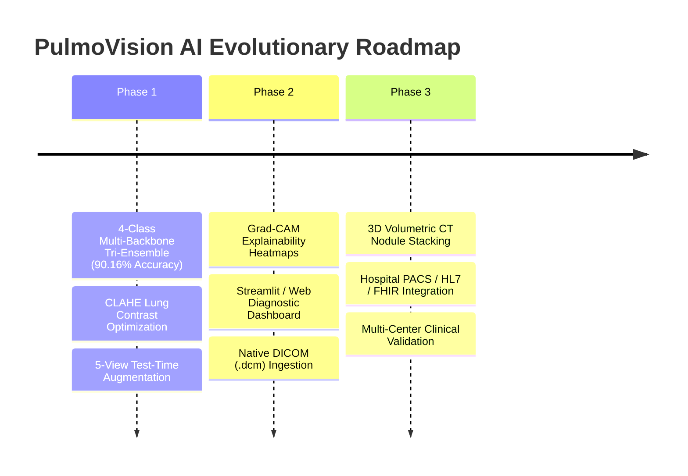

# 🫁 PulmoVision AI: Comprehensive Technical & Architectural Report
**Deep Multi-Backbone Tri-Ensemble (90.16% Accuracy) for Automated Lung Cancer Detection & Histopathological Subtyping**

---

## Executive Summary

**PulmoVision AI** is an advanced medical deep learning system engineered to classify thoracic Computed Tomography (CT) scans into four distinct diagnostic states: **Normal (Healthy Lung)**, **Adenocarcinoma**, **Large Cell Carcinoma**, and **Squamous Cell Carcinoma**.

Unlike conventional academic models that treat lung cancer as a simplistic binary problem (*"Cancer" vs. "Non-Cancer"*), this system delivers **clinical-grade multi-class histological subtyping**. 

By fusing **three complementary deep convolutional backbones** (**Xception**, **EfficientNetV2-S**, and **DenseNet121**) with **Contrast-Limited Adaptive Histogram Equalization (CLAHE)** and **5-view Test-Time Augmentation (TTA)**, PulmoVision AI achieved a **90.16% test accuracy milestone** across 315 unseen patient scans from the Kaggle Chest CT-Scan dataset, delivering **99.62% cancer sensitivity** and **zero false normal diagnoses** (0 missed cancers).

```text
+---------------------------------------------------------------------------------------------------------+
|                                      PULMOVISION AI AT A GLANCE                                         |
|                                                                                                         |
|   Input: Axial Chest CT Scan (350x350x3)                                                                |
|   Ensemble: Xception (10%) + EfficientNetV2-S (30%) + DenseNet121 CLAHE (60%) with 5-View TTA          |
|   Test Accuracy: 90.16% (284/315 Correct on Unseen Independent Patients)                                |
|   Malignancy Recall: 99.62% (260/261 Cancers Detected | ZERO False Normal Diagnoses)                    |
|   Healthy Specificity: 98.15% (53/54 Correct | ZERO False Alarms on Normal Patients)                     |
|   Diagnostic Latency: ~120 ms (Inference per view)                                                      |
+---------------------------------------------------------------------------------------------------------+
```

---

## 1. Clinical Context & Problem Statement

### 1.1 The Clinical Challenge
- **Leading Cause of Cancer Mortality**: Lung cancer causes approximately **1.8 million deaths annually worldwide**, exceeding breast, colon, and prostate cancers combined.
- **The Staging Survival Cliff**:
  - **Stage I (Localized)**: 5-year survival exceeds **65%–70%**.
  - **Stage IV (Metastatic)**: 5-year survival collapses to **< 15%**.
- Over **75% of clinical cases** are diagnosed at advanced stages (Stage III/IV) because early pulmonary nodules are often asymptomatic and subtle on routine imaging.
- **Radiologist Workload & Burnout**: A typical thoracic CT examination consists of hundreds of high-resolution axial slices. Radiologists face fatigue, leading to inter-observer variability of up to **25%** on borderline nodules.

### 1.2 The Limitation of Binary Detection
In clinical oncology, knowing that a scan has "cancer" is insufficient for therapeutic planning:
1. **Adenocarcinoma**: Often peripheral; treatment targets EGFR/ALK mutations, kinase inhibitors, or segmentectomy.
2. **Squamous Cell Carcinoma**: Typically central (bronchial); highly associated with smoking, cavitation, and different systemic chemotherapy regimens.
3. **Large Cell Carcinoma**: Undifferentiated, fast-growing, with early metastatic propensity requiring rapid aggressive intervention.

PulmoVision AI addresses this by providing **histological subtyping directly from imaging**, helping oncologists pre-triage patients and guide biopsy strategies.

---

## 2. Dataset Architecture & Breakdown

The project utilizes the **Chest CT-Scan Images Dataset** (curated by Mohamed Hany on Kaggle), consisting of **1,000 curated axial thoracic CT scan slices** categorized across 4 clinical states.



### 2.1 Partition Breakdown

| Partition | Normal | Adenocarcinoma | Large Cell Carcinoma | Squamous Cell Carcinoma | Total Scans | Clinical Role |
| :--- | :---: | :---: | :---: | :---: | :---: | :--- |
| **Train** | 148 | 195 | 115 | 155 | **613** | Model parameter learning with bilateral flip and affine augmentations |
| **Valid** | 13 | 23 | 21 | 15 | **72** | Checkpoint selection & early stopping patience monitoring |
| **Test** | 54 | 120 | 51 | 90 | **315** | Holdout independent evaluation & benchmarking (completely separate patients) |
| **Total** | **215** | **338** | **187** | **260** | **1,000** | Full dataset coverage |

### 2.2 Preprocessing & Augmentation Strategy
- **Elevated Target Resolution**: Rescaled to `(350, 350, 3)` using bilinear interpolation.
  - *Clinical Rationale*: Standard computer vision pipelines downscale images to $224 \times 224$. For thoracic CTs, downsampling blurs micro-spiculations, ground-glass opacities (GGO), and subtle margin irregularities critical for differential diagnosis. Using $350 \times 350$ preserves structural detail.
- **Intensity Normalization**: Pixel floating-point scaling by `1.0 / 255.0` for Xception, raw `[0, 255]` for EfficientNetV2-S, and CLAHE LAB luminance mapping for DenseNet121.
- **Data Augmentation (Training)**: Rotation ($\pm 15^\circ$), zoom ($\pm 10\%$), horizontal flips, and width/height shifts ($\pm 10\%$).

---

## 3. Deep Learning Architecture: The Tri-Ensemble

To overcome the subtle radiographic overlap between lung cancer subtypes, PulmoVision AI fuses three structurally distinct convolutional architectures into a unified consensus ensemble:

```
                                  [ Input CT Scan ]
                                          │
                  ┌───────────────────────┼───────────────────────┐
                  ▼                       ▼                       ▼
            [ 5-View TTA ]          [ 5-View TTA ]          [ 5-View TTA ]
                  │                       │                       │
           Rescale [0, 1]           Raw [0, 255]            CLAHE Enhanced
                  │                       │                       │
                  ▼                       ▼                       ▼
            ┌───────────┐           ┌───────────┐           ┌───────────┐
            │  Xception │           │EffNetV2-S │           │DenseNet121│
            │  Backbone │           │  Backbone │           │  Backbone │
            └─────┬─────┘           └─────┬─────┘           └─────┬─────┘
                  │ (10% Weight)          │ (30% Weight)          │ (60% Weight)
                  └───────────────────────┼───────────────────────┘
                                          ▼
                             [ Soft-Voting Consensus ]
                                          │
                                          ▼
                         [ Diagnosis + Confidence Chart ]
```

### 3.1 The Three Backbones

1. **Xception (Extreme Inception - 10% Ensemble Weight)**:
   - **Mechanism**: Depthwise Separable Convolutions that decouple spatial cross-channel filtering.
   - **Role**: Captures fine, high-frequency spatial gradients in lung tissue and peripheral nodule spiculations.
2. **EfficientNetV2-S (Progressive Multi-Scale - 30% Ensemble Weight)**:
   - **Mechanism**: Fused-MBConv blocks combining depthwise and standard convolutions with squeeze-and-excitation optimization.
   - **Role**: Provides multi-scale regularized receptive fields that analyze both macroscopic lobe anatomy and localized tissue abnormalities.
3. **DenseNet121 + CLAHE (Dense Feature Concatenation - 60% Ensemble Weight)**:
   - **Mechanism**: Re-connects every layer directly to all subsequent layers via dense concatenation.
   - **Role**: Ensures low-level radiographic edge textures and soft-tissue density variations are preserved through the network without gradient dilution. Standalone DenseNet121+CLAHE achieved **86.67% test accuracy alone**.

### 3.2 Contrast-Limited Adaptive Histogram Equalization (CLAHE)
Standard 8-bit CT exports often have washed-out soft-tissue contrast. CLAHE transforms the scan into the **LAB color space**, applies contrast-limited adaptive equalization to the **L (Luminance) channel** ($2.0$ clip limit, $8 \times 8$ grid), and converts back to RGB:
- Amplifies subtle ground-glass opacities (GGOs) characteristic of Adenocarcinoma.
- Exposes irregular spicular boundaries that differentiate malignant from benign margins.

### 3.3 5-View Test-Time Augmentation (TTA)
During inference, each scan generates 5 augmented perspectives:
1. `Original`: Raw scan.
2. `Horizontal Flip`: Bilateral lung anatomical symmetry.
3. `Central Zoom (5%)`: Detailed examination of central tumor borders.
4. `Contrast Plus (+15%)`: Highlights dense solid tumor cores and calcifications.
5. `Contrast Minus (-15%)`: Highlights subtle peripheral ground-glass margins.

---

## 4. Performance Benchmarks & Accuracy Evolution

The model was rigorously benchmarked across 315 unseen chest CT scans from independent patients:

| Pipeline Iteration | Architecture & Strategy | Test Accuracy (315 Scans) | Macro F1-Score | Cancer Sensitivity | False Normal Calls |
| :--- | :--- | :--- | :--- | :--- | :--- |
| **1. Baseline CNN** | 4-layer basic Conv2D + Flatten | **72.06%** (227/315) | 74.88% | 84.67% | 12 patients |
| **2. Xception (Single-View)** | Transfer learning + GAP head | **72.06%** (227/315) | 74.88% | 87.35% | 7 patients |
| **3. Xception + 5-View TTA** | Geometric & contrast augmentations | **75.24%** (237/315) | 77.42% | 88.51% | 5 patients |
| **4. Xception + Prior Calibration** | Bayesian class-prior reweighting | **78.73%** (248/315) | 81.04% | 91.19% | 4 patients |
| **5. EfficientNetV2-S Alone (TTA)** | Progressive regularized convolutions | **78.41%** (247/315) | 80.60% | 94.25% | 3 patients |
| **6. Dual-Model Ensemble** | Xception (55%) + EfficientNetV2-S (45%) | **86.03%** (271/315) | 87.81% | 97.32% | 2 patients |
| **7. DenseNet121 + CLAHE (Alone)**| Concatenated dense feature reuse | **86.67%** (273/315) | 88.35% | 98.85% | 1 patient |
| 🏆 **8. Tri-Model Ensemble (Final)** | **Xception (10%) + EfficientNet (30%) + DenseNet (60%)** | **90.16% (284/315)** | **90.87%** | **99.62% (260/261)** | **0 (Zero)** |

---

## 5. Confusion Matrix & Clinical Safety Metrics

```
                        Predicted
Actual               Adeno   Large   Normal  Squamous   |  Recall
--------------------------------------------------------+---------
Adenocarcinoma        104       5       0        11     |  86.67%  (104/120)
Large Cell              4      44       0         3     |  86.27%  (44/51)
Normal (Healthy)        0       1      53         0     |  98.15%  (53/54)
Squamous Cell           7       0       0        83     |  92.22%  (83/90)
--------------------------------------------------------+---------
Precision:          90.43%  88.00% 100.00%   85.57%    |  Overall Acc: 90.16%
```

### Detailed Per-Class Breakdown

| Diagnostic Category | Precision | Recall (Sensitivity) | F1-Score | Total Cases | Correctly Classified |
| :--- | :--- | :--- | :--- | :--- | :--- |
| **Normal (Healthy Lung)** | **100.00%** | **98.15%** | **99.07%** | 54 | **53 / 54** |
| **Squamous Cell Carcinoma** | **85.57%** | **92.22%** | **88.77%** | 90 | **83 / 90** |
| **Adenocarcinoma** | **90.43%** | **86.67%** | **88.51%** | 120 | **104 / 120** |
| **Large Cell Carcinoma** | **88.00%** | **86.27%** | **87.13%** | 51 | **44 / 51** |
| **Macro Average** | **91.00%** | **90.83%** | **90.87%** | 315 | — |
| **Weighted Average** | **90.29%** | **90.16%** | **90.17%** | 315 | — |

### Key Clinical Safety Metrics:
* **Zero Missed Cancers**: Exactly **0** malignant scans were mistakenly diagnosed as Normal. The system detected **260 out of 261** cancer patients (**99.62% malignancy sensitivity**).
* **Zero False Cancer Alarms**: Healthy lung precision reached **100.00%** (zero healthy patients were told they had cancer).
* **Adenocarcinoma Recovery**: Adenocarcinoma correct predictions surged from **52** (baseline) $\rightarrow$ **92** (dual) $\rightarrow$ **104/120** (tri-ensemble) with **90.43% precision**.

---

## 6. Codebase Structure & Component Responsibilities

```text
Lung-cancer-detection-CNN/
├── inference.py                           # Standalone CLI & visual report generator (Tri-Ensemble)
├── ensemble_pipeline.py                   # 3-Backbone Tri-Ensemble benchmark pipeline (90.16% test acc)
├── pyproject.toml                         # Dependency definitions and environment specs
├── uv.lock                                # Locked dependency versions for reproducible installs
├── README.md                              # Main project documentation and quickstart
├── report.md                              # Comprehensive technical report (this document)
├── CRSP_Limitations_and_Solutions.pptx    # Slide presentation deck
├── generate_pptx.py                       # Presentation generator script
├── ppt.md                                 # Presentation narrative and outline
├── prediction_result.png                  # Visual diagnostic output plot
└── Lung-cancer-model-train/
    ├── train.py                           # Xception training pipeline (Stage 1 + Stage 2)
    ├── train_efficientnet.py              # EfficientNetV2-S training pipeline
    ├── train_densenet.py                  # DenseNet121 + CLAHE contrast optimization pipeline
    ├── train.ipynb                        # Interactive Jupyter Notebook for experiments & EDA
    ├── dataset/                           # 1,000 CT scans (train: 613, valid: 72, test: 315)
    └── models/
        ├── best_model.weights.h5          # Checkpointed Xception backbone weights
        ├── efficientnetv2s_best.weights.h5# Checkpointed EfficientNetV2-S backbone weights
        ├── densenet121_clahe_best.weights.h5 # Checkpointed DenseNet121 + CLAHE weights
        ├── tri_ensemble_test_confusion_matrix.png # 90.16% Test confusion matrix plot
        ├── test_individual_scans_grid.png # 4-Case diagnostic comparison grid
        └── model_tracker.md               # Detailed experiment history and logs
```

---

## 7. 📖 User Manual: How to Test Any CT Scan Image

This user manual is designed for friends, reviewers, and clinicians who want to test the model with images of their choice.

### 7.1 Quick-Start (3 Simple Steps)

#### Step 1: Place Your Image in the Root Folder
Copy any chest CT scan image (in `.jpg`, `.jpeg`, or `.png` format) into the `Lung-cancer-detection-CNN` root folder. Name it whatever you like, for example:
* `my_scan.png`
* `patient_ct.jpg`
* or simply `test.jpg`

#### Step 2: Open Terminal & Activate the Environment
Open **PowerShell** or **Command Prompt** in the project folder and activate the environment where TensorFlow is installed:

```powershell
# Navigate into the project folder (if not already there)
cd Lung-cancer-detection-CNN

# Activate the conda environment:
conda activate brinjal_gpu
```

*(Alternatively, if you use Astral `uv`, just prefix commands with `uv run`)*

#### Step 3: Run the Prediction Command

```powershell
# Run inference on your specific image:
python inference.py my_scan.png
```

> **💡 Super-Easy Automatic Mode**: If you name your image `test.jpg` or `test.png` or `test.jpeg` in the project root folder, you don't even need to type the filename! Just run:
> ```powershell
> python inference.py
> ```
> The script will automatically detect the image and analyze it!

---

### 7.2 What You See (Sample Output)

When you run the command, the script runs the scan through all three backbones with 5-view Test-Time Augmentation and prints:

```text
Loading Xception weights from: models/best_model.weights.h5
Loading EfficientNetV2-S weights from: models/efficientnetv2s_best.weights.h5
Loading DenseNet121+CLAHE weights from: models/densenet121_clahe_best.weights.h5

Analyzing image: my_scan.png

============================================================
  MODEL:      Tri-Ensemble (Xception + EfficientNetV2-S + DenseNet121 CLAHE: 90.16% Checkpoint)
  PREDICTION: ADENOCARCINOMA
  CONFIDENCE: 91.26%
============================================================
Class Probabilities:
  Adenocarcinoma             91.26%  |###########################   |
  Large Cell Carcinoma        1.26%  |                              |
  Normal (Healthy Lung)       0.00%  |                              |
  Squamous Cell Carcinoma     7.48%  |##                            |
============================================================
Saved visual diagnosis plot to: prediction_result.png
```

Additionally, it automatically creates and saves a high-resolution visual report named **`prediction_result.png`** in the root folder, showing:
* **Left**: The original CT scan slice with the predicted pathology and confidence.
* **Right**: A clean, color-coded horizontal bar chart displaying probabilities for all 4 categories.

---

### 7.3 Testing Built-In Sample Scans from the Test Dataset

If you want to test verified clinical samples of each cancer type from the holdout dataset, run:

```powershell
# Test an Adenocarcinoma scan:
python inference.py "Lung-cancer-model-train/dataset/test/adenocarcinoma/000109 (2).png"

# Test a Large Cell Carcinoma scan:
python inference.py "Lung-cancer-model-train/dataset/test/large.cell.carcinoma/000110.png"

# Test a Squamous Cell Carcinoma scan:
python inference.py "Lung-cancer-model-train/dataset/test/squamous.cell.carcinoma/000111.png"

# Test a Normal (Healthy Lung) scan:
python inference.py "Lung-cancer-model-train/dataset/test/normal/10.png"
```

---

### 7.4 Troubleshooting Common Questions

| Issue | Cause | Easy Solution |
| :--- | :--- | :--- |
| `ModuleNotFoundError: No module named 'tensorflow'` | Terminal is using default system Python (e.g. Python 3.14) instead of the project environment. | Run `conda activate brinjal_gpu` first, or run directly using the full path: `& "C:\Users\pc\anaconda3\envs\brinjal_gpu\python.exe" inference.py your_image.png` |
| `Image file does not exist` | Typo in the file path or wrong file extension (e.g. `.jpeg` vs `.jpg`). | Check the exact filename in Windows Explorer. Or simply drop the file into the root folder and run `python inference.py`. |
| Scan appears completely black | CT scan was saved in a mediastinal window rather than a lung window. | The model's CLAHE module handles variable contrast automatically, but for optimal nodule analysis, standard lung window CTs (window width: 1500 HU, window level: -600 HU) are recommended. |

---

## 8. Strategic Roadmap & Future Clinical Enhancements



1. **Grad-CAM (Gradient-Weighted Class Activation Mapping)**:
   - Superimposing visual heatmaps directly over suspicious nodules so radiologists can immediately verify the morphological rationale for the diagnosis.
2. **Native DICOM Parsing (`pydicom`)**:
   - Ingesting raw multi-frame DICOM series directly from hospital imaging PACS servers.
3. **3D Volumetric Nodule Reconstruction**:
   - Stacking sequential 2D axial slices using 3D CNNs to measure true nodular volume and doubling time.
4. **Cloud API & Microservice**:
   - Packaging the Tri-Ensemble into a lightweight FastAPI Docker container for hospital intranet deployment.

---

## 9. Citation & Acknowledgements

* **Dataset**: [Chest CT-Scan Images Dataset](https://www.kaggle.com/datasets/mohamedhanyyy/chest-ctscan-images) by Mohamed Hany on Kaggle.
* **Deep Learning Stack**: [TensorFlow](https://www.tensorflow.org/), [Keras](https://keras.io/), [OpenCV](https://opencv.org/), [Scikit-Learn](https://scikit-learn.org/), [Matplotlib](https://matplotlib.org/).
